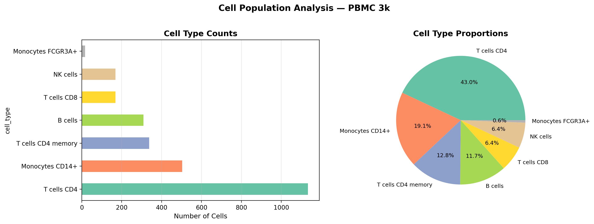
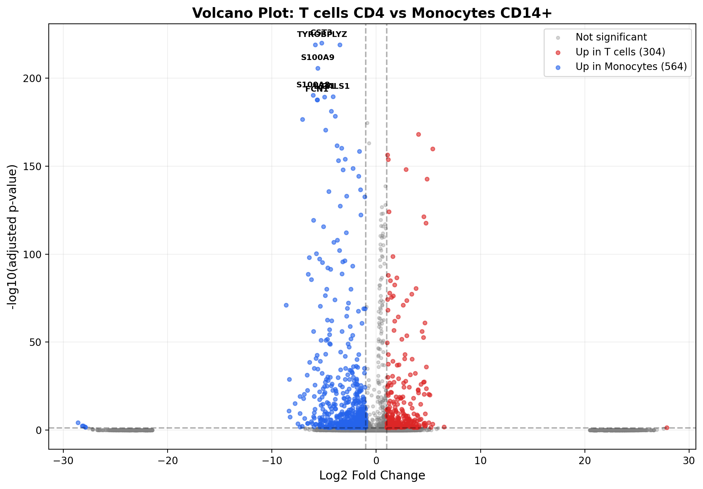

# SingleCell-PBMC-Analysis
Single-cell RNA-Seq analysis of 2,700 PBMCs using Scanpy. Complete pipeline: QC, normalization, HVG selection, PCA, UMAP, Leiden clustering, marker gene identification, and cell type annotation (T cells, B cells, NK cells, Monocytes, DCs).


# Single-Cell RNA-Seq Analysis of Blood Immune Cells

Complete single-cell analysis pipeline on 2,700 PBMCs (blood immune cells) using Scanpy. Goes from raw count matrix to cell type discovery — the same workflow used at 10x Genomics, Genentech, and most cancer genomics labs.

## Why this matters

Single-cell RNA-seq lets you see what each individual cell is doing, not just the average of millions of cells. In cancer research, this is how we find rare drug-resistant cell populations, map the tumor microenvironment, and discover new cell states. It's probably the most in-demand computational biology skill right now.

## What this project does

Takes the standard PBMC 3k dataset (2,700 blood cells from 10x Genomics) and runs the full analysis:

1. **Quality control** — filter dead cells (high mitochondrial %) and doublets
2. **Normalization** — CPM + log transform to make cells comparable
3. **Feature selection** — find ~1,800 highly variable genes from 13,000+
4. **Dimensionality reduction** — PCA (50 PCs) then UMAP for visualization
5. **Clustering** — Leiden algorithm finds 8 cell populations
6. **Marker gene identification** — Wilcoxon test per cluster
7. **Cell type annotation** — assign biological identity using known markers (CD4, CD8, CD14, CD79A, NKG7, etc.)
8. **Differential expression** — volcano plot comparing T cells vs Monocytes

## Cell types identified

| Cell Type | Proportion |
|-----------|-----------|
| T cells CD4 | 43.0% |
| Monocytes CD14+ | 19.1% |
| T cells CD4 memory | 12.8% |
| B cells | 11.7% |
| T cells CD8 | 6.4% |
| NK cells | 6.4% |
| Monocytes FCGR3A+ | 0.6% |

## Results

### UMAP with cell type annotations


### Quality control metrics


### Known marker genes on UMAP


### Cell type proportions


### Volcano plot: T cells vs Monocytes


## What I learned

- The complete scRNA-seq workflow from raw counts to biological interpretation
- Why QC matters (mitochondrial content = dying cells, too many genes = doublets)
- How UMAP reveals cell population structure from high-dimensional data
- Using known marker genes to annotate clusters with real cell type labels
- Differential expression at single-cell level

## Connection to my thesis

My M.Tech thesis at IIIT Delhi is on chromatin compartments and epigenetic memory. Single-cell methods are increasingly used to study chromatin accessibility (scATAC-seq) and epigenetic heterogeneity. This project builds the foundation for those analyses.

## How to run

```bash
pip install scanpy leidenalg matplotlib seaborn pandas numpy
```

Run `SingleCell_PBMC_Analysis.ipynb` in Google Colab. Takes ~10 minutes. No GPU needed.

## Tools

Python, Scanpy, Leiden algorithm, UMAP, Wilcoxon test, matplotlib, seaborn

## References

- Wolf et al. (2018). SCANPY: large-scale single-cell gene expression data analysis. Genome Biology.
- 10x Genomics PBMC 3k dataset
- Traag et al. (2019). From Louvain to Leiden. Scientific Reports.

---
Pradip Palekar | MT25215 | M.Tech Computational Biology, IIIT Delhi
pradip25215@iiitd.ac.in
